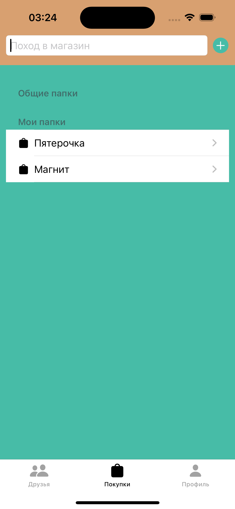
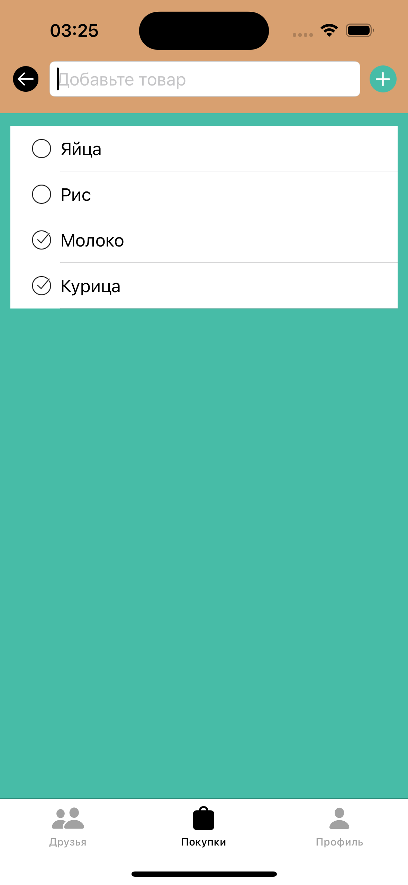

# Приложение для создания списка покупок для совместного использования

Выполнено на языке Swift (iOS).

## 📷 Скриншоты

  
  
  

  
  
  

## 🚀 Установка

1. Клонируйте репозиторий:
   
git clone https://github.com/JLNap/noteTogether.git

2. Откройте проект в Xcode.

## ✨ Особенности

- Авторизация через Firebase
- Модуль с друзьями (для совместных покупок)
- Без регистрации данные хранятся в CoreData
- С регистрацией хранятся в Firebase
- Один человек создает ивент например поход в магазин и добавляет список потом приглашает в этот ивент своего друга и тот может в магазине отмечать какие продукты уже купил у обоих пользователей синхронизация происходит через Firebase и они могут дополнять или изменять список
- SwiftUI MVVM

## 👤 Автор

Андрей Чучупал  
[Связаться](https://t.me/achuchupal)
